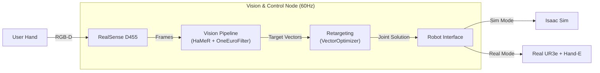

# DexTel: Real-Time UR3e Teleoperation System

## Project Overview

**Goal**: Implement a robust real-time teleoperation system for a **UR3e** using a **One RGB-D Camera** and **AI-based hand tracking**.

**Core Tech**: ROS 2 Jazzy, MediaPipe + HaMeR (Vision), Dex-Retargeting (Optimization), Isaac Sim.

---

## System Architecture

The system uses an optimization-based approach to map human hand vectors to robot joint angles in real-time.

---

## Development Roadmap

The project was executed in three distinct phases.

### Phase 1: Vision & Tracking
**Focus**: Establishing separate, reliable hand tracking and pose estimation.
- **Key Tasks**:
  1.  Setup Conda environment and install RealSense SDK / PyTorch.
  2.  Implement `ur3_realsense_hamer.py` for 3D Keypoint estimation.
  3.  Develop `RobustTracker` to fuse RGB inference with Depth data.
  4.  Tune **OneEuroFilter** to eliminate jitter.
  5.  Verify hand coordinate frame consistency (Red=Forward, Green=Normal).

### Phase 2: Retargeting & Simulation
**Focus**: Safe testing in Isaac Sim without hardware risks.
- **Key Tasks**:
  1.  Configure `dex-retargeting` with `ur3e_hande.urdf`.
  2.  Implement **Vector Optimization** to map hand vectors to robot tool orientation.
  3.  Develop `dextel_node.py` as the main ROS 2 orchestrator.
  4.  Create `sim_launch.py` to automate Isaac Sim startup with ROS 2 Bridge.
  5.  Verify full kinematic loop: Camera -> vectors -> Joint Angles -> Sim Robot.

### Phase 3: Real Robot Integration
**Focus**: deploying to physical hardware and ensuring safety.
- **Key Tasks**:
  1.  Implement `RealRobotInterface` publishing to `scaled_joint_trajectory_controller`.
  2.  Create `simple_robotiq_driver.py` for direct socket control of the gripper.
  3.  Validating Pick & Place tasks with physical objects.

---

## Detailed Documentation
For a breakdown of the code and file structure, see:
- **[Technical Manual](Technical_Manual.md)**
- **[Phase 1 Guide](Step1.md)**
- **[Phase 2 Guide](Step2.md)**
- **[Phase 3 Guide](Step3.md)**
